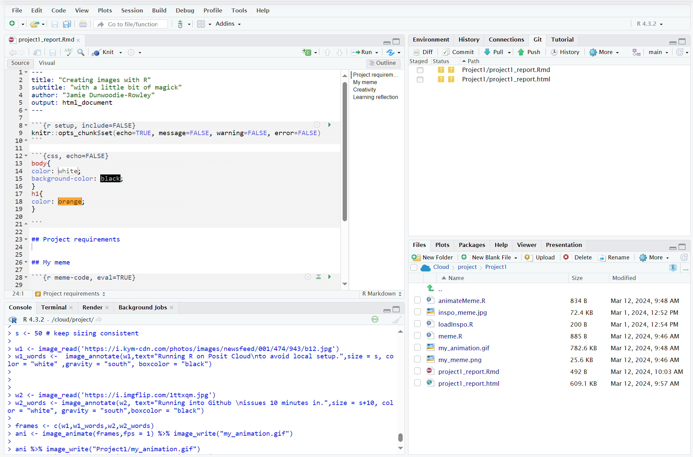
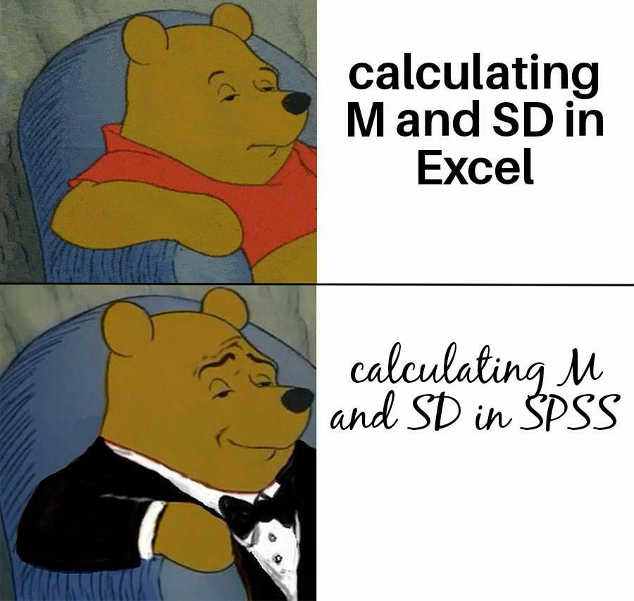

```{r setup, include=FALSE}
knitr::opts_chunk$set(echo=TRUE, message=FALSE, warning=FALSE, error=FALSE)
```

```{css, echo=FALSE}
body{
color: white;
background-color: black;
text-align: center;
}
h1{
color: orange;
}
pre, code{
text-align: left;
}

```

## Project requirements
I have met the requirements for part A of this project by successfully setting up the GitHub repo and associated markdown file [GitHub](https://github.com/Jaorow/stats220),  [GitHubPages](https://jaorow.github.io/stats220/) this was nothing new to me as a computer science major and I had done it many times before... something new I learnt here was how to add a gif to a .md file see the following screenshot for my RStudio setup hosted on posit cloud  the most fun I had with this stage is setting up the GitHub pages static site as I had only used things such as azure to host sites before, it was fun to host a site in such a straight forward manor. 

## My meme



I changed many features of this meme. firstly I made the text ontop of the diffrent sections as i didnt like the whitespace in the original meme, i also changed the images to better suit my meme idea. 
```{r meme-code, eval=TRUE}
#meme generation script

#suit: Running R on posit Cloud to avoid local setup - https://i.kym-cdn.com/photos/images/newsfeed/001/474/943/b12.jpg
#Looking at notes: running into git issues 10 minutes in https://i.imgflip.com/1ttxqm.jpg

library(magick)

s <- 50 #keep sizing consistent 

w1 <- image_read('https://i.kym-cdn.com/photos/images/newsfeed/001/474/943/b12.jpg') %>%
  image_annotate(text="Running R on Posit Cloud\nto avoid local setup.",size = s, color = "white" ,gravity = "south", boxcolor = "black")


w2 <- image_read('https://i.imgflip.com/1ttxqm.jpg') %>% 
  image_annotate(text="Running into Github \nissues 10 minutes in.",size = s+10, color = "white", gravity = "south",boxcolor = "black")


combined <- image_scale(image_append(c(image_scale(w1,"300"), image_scale(w2,"300")), stack=TRUE),"300")
print(combined)

combined %>% image_write("my_meme.png")

```

```{r animation-code, eval=FALSE}

#meme generation script

#suit: Running R on posit Cloud to avoid local setup - https://i.kym-cdn.com/photos/images/newsfeed/001/474/943/b12.jpg
#Looking at notes: running into git issues 10 minutes in https://i.imgflip.com/1ttxqm.jpg

library(magick)

s <- 50 # keep sizing consistent 

w1 <- image_read('https://i.kym-cdn.com/photos/images/newsfeed/001/474/943/b12.jpg')
w1_words <-  image_annotate(w1,text="Running R on Posit Cloud\nto avoid local setup.",size = s, color = "white" ,gravity = "south", boxcolor = "black")
 


w2 <- image_read('https://i.imgflip.com/1ttxqm.jpg')
w2_words <- image_annotate(w2, text="Running into Github \nissues 10 minutes in.",size = s+10, color = "white", gravity = "south",boxcolor = "black")

image_animate(c(w1,w1_words,w2,w2_words),fps = 1) %>% image_write("my_animation.gif")


```


## Creativity
I think that i demonstrated some creativity in the css of this RMD code, i also changed my site to include a link to this knitted file so that it can be viewed from my github pages site

## Learning reflection
I learnt a lot through this project and thoroughly enjoyed it, it was fun to learn the basics of GitHub pages, R and Rmd (I was pleasantly surprised at how useful and intuitive Rmd is) I loved how the editor did things such as displaying components such as images when coding... it made a lot of steps much easer to debug. I'm excited to see how the combination of R and Rmd can be utilized to handle large amounts of data later in the course.


